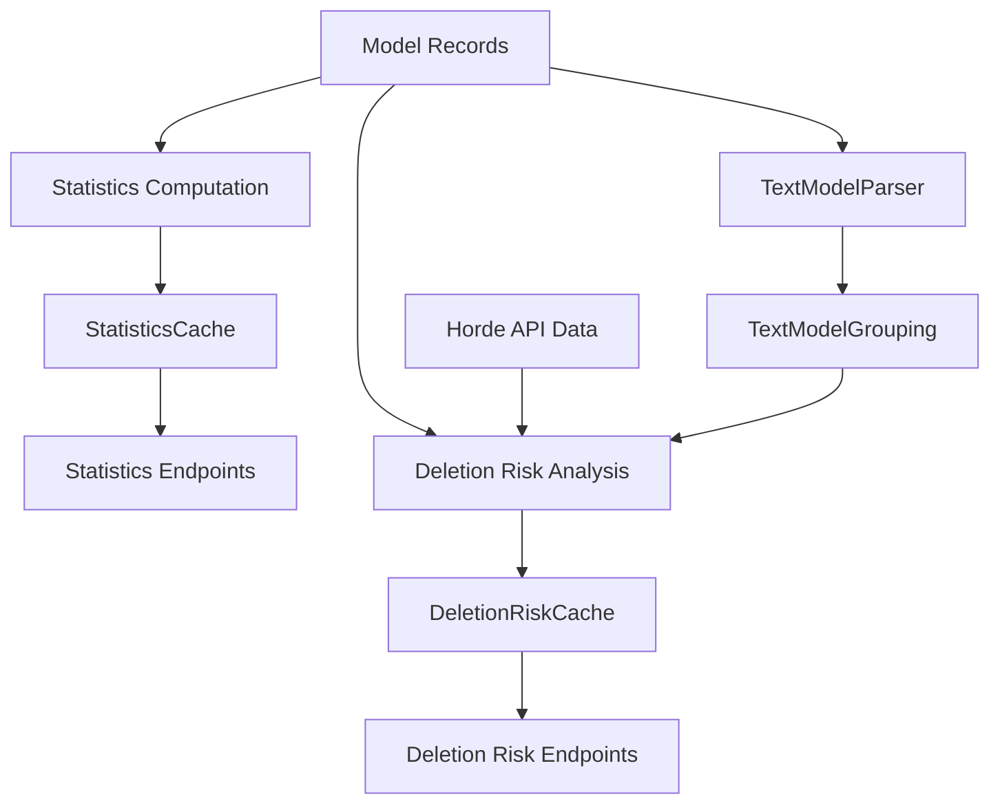
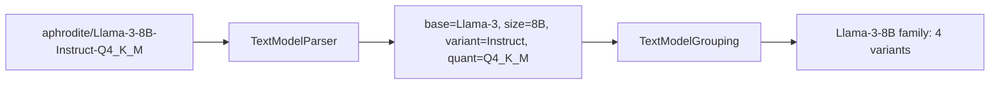

# Analytics Pipeline

The analytics subsystem computes aggregate statistics over model reference data, runs deletion risk analysis, and parses text model names into structured families. Results are cached with Redis support and can be pre-populated by a background hydrator.

## Data Flow

## Statistics Computation

`statistics.py` computes per-category aggregates from model records:

- **Baseline distribution** — counts and percentages per baseline (e.g., `stable_diffusion_xl`: 42%)
- **Parameter buckets** — for text generation, groups models into size ranges (< 3B, 3B-6B, 70B-100B, 100B+)
- **Download stats** — total entries, total size in bytes, average size, host distribution
- **Tag and style distributions** — counts per tag/style with percentages

Results are modeled as Pydantic classes (`CategoryStatistics`, `BaselineStats`, `DownloadStats`, `TagStats`, `ParameterBucketStats`) for type-safe serialization to API responses.

## Cache Infrastructure

Analytics results are expensive to compute (they require fetching Horde API data and iterating all models). A two-tier caching system keeps responses fast.

### RedisCache Base Class

`base_cache.py` provides `RedisCache[T]`, a generic abstract base for singleton caches. Subclasses implement four methods:

| Method                              | Purpose                                   |
| ----------------------------------- | ----------------------------------------- |
| `_get_cache_key_prefix()`           | Redis key namespace (e.g., `horde:stats`) |
| `_get_ttl()`                        | Cache entry TTL in seconds                |
| `_get_model_class()`                | Pydantic model class for deserialization  |
| `_register_invalidation_callback()` | Hook into backend invalidation signals    |

The cache checks Redis first (if available), then falls back to an in-memory dict with timestamp tracking. Thread safety is provided by `RLock`.

### Stale-While-Revalidate

When cache hydration is enabled, the cache implements a stale-while-revalidate pattern:

- **Normal TTL** — controls when background hydration refreshes the entry
- **Stale TTL** — maximum age before returning `None` (forcing synchronous computation)
- Clients always receive cached data immediately while the hydrator refreshes in the background

### Concrete Caches

- **`StatisticsCache`** — caches `CategoryStatistics` with TTL from `statistics_cache_ttl` (default 300s)
- **`DeletionRiskCache`** — caches `CategoryDeletionRiskResponse` with TTL from `deletion_risk_cache_ttl` (default 300s)

Both auto-invalidate when the backend signals a data change (e.g., after a model is created or deleted).

## Cache Hydrator

`CacheHydrator` is a singleton background service started during the FastAPI lifespan. It proactively refreshes caches on a configurable interval so clients never wait for cold computation.

The hydration cycle iterates over supported categories (`image_generation`, `text_generation`) and their grouping variants:

1. Fetches fresh Horde API data (model status, usage statistics)
2. Merges with model reference records via `DataMerger`
3. Computes deletion risk analysis through `ModelDeletionRiskInfoFactory`
4. Stores results in the appropriate cache

Configuration via environment variables:

| Setting                                 | Default | Purpose                                   |
| --------------------------------------- | ------- | ----------------------------------------- |
| `CACHE_HYDRATION_ENABLED`               | `False` | Enable background hydration               |
| `CACHE_HYDRATION_INTERVAL_SECONDS`      | 240     | Refresh interval (should be < cache TTLs) |
| `CACHE_HYDRATION_STALE_TTL_SECONDS`     | 3600    | Max age before stale data is discarded    |
| `CACHE_HYDRATION_STARTUP_DELAY_SECONDS` | 5       | Delay before first hydration run          |

## Deletion Risk Analysis

`deletion_risk_analysis.py` performs risk and usage analysis over model records enriched with Horde runtime data:

- **Deletion risk scoring** — flags models with no workers, zero usage, or downloads hosted outside preferred hosts
- **Low usage detection** — configurable thresholds (different for image vs text models)
- **Backend variation tracking** — for text models, tracks per-backend worker counts and usage

`FilterPresets` provides named filter combinations for common deletion risk queries (e.g., "at-risk models", "high usage", "no workers").

## Text Model Pipeline

Text model names encode significant metadata (base model, size, variant, quantization) that needs to be parsed for meaningful grouping and analysis.

**`TextModelParser`** uses regex patterns to extract:

- **Size** — parameter counts like `7B`, `13B`, MoE patterns like `8x7B`
- **Variant** — indicators like `Instruct`, `Chat`, `Code`, `Uncensored`
- **Quantization** — K-quants (`Q4_K_M`), legacy quants (`Q4_0`), formats (`GGUF`, `GPTQ`, `AWQ`, `EXL2`)

Results are cached with `@lru_cache` for repeated lookups.

**`TextModelGrouping`** clusters parsed models by their base name and size, producing family groups. This powers the `grouped=true` query parameter on analytics endpoints, collapsing dozens of quantization variants into a single family entry.
