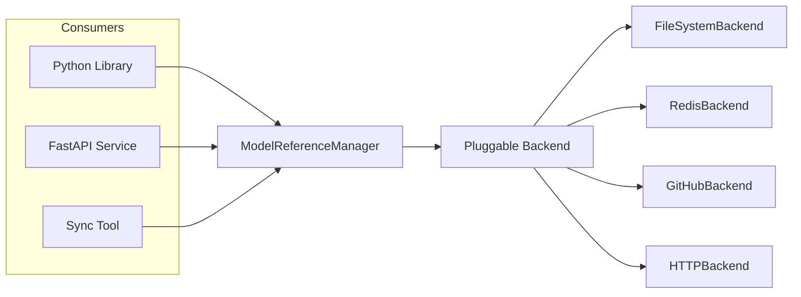
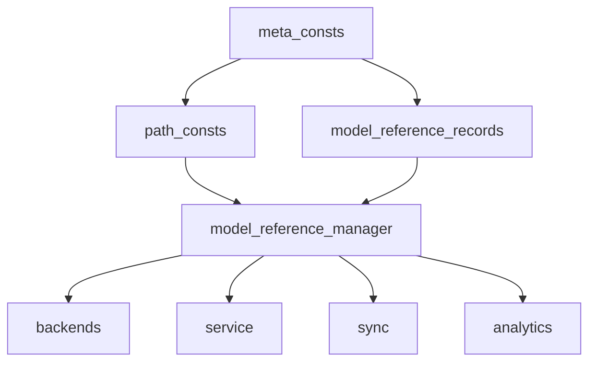

# Architecture Overview

Horde Model Reference serves three roles from a single codebase: a **Python library** for querying model metadata, a **FastAPI service** for HTTP access and CRUD operations, and a **sync tool** for keeping legacy GitHub repositories up to date. Each role shares the same backbone modules and backend system but activates different subsystems.

## Backbone Modules

Four modules form the foundation that every other part of the codebase depends on. Understanding their layering is essential for navigating the project.

**`meta_consts.py`** defines all domain enums (`MODEL_REFERENCE_CATEGORY`, `MODEL_DOMAIN`, `MODEL_PURPOSE`, baselines) and registries. `CategoryDescriptor` ties each category to its domain, purpose, GitHub source, and JSON filename. Every other module imports from here to route logic and validate data.

**`path_consts.py`** provides `HordeModelReferencePaths`, a singleton that computes every filesystem path (base, legacy, showcase, meta, audit, pending queue) and builds filename/URL dictionaries from `CategoryDescriptor` data. All backends and the service layer use it to locate files.

**`model_reference_records.py`** contains the Pydantic model hierarchy (`GenericModelRecord` and its specialized subclasses) and the `@register_record_type(category)` decorator that populates `MODEL_RECORD_TYPE_LOOKUP`. This is the schema contract that backends write to and consumers read from. `DownloadRecord` carries per-file metadata including `file_purpose` for on-disk component routing and `size_bytes` for space estimation.

**`model_reference_manager.py`** hosts the `ModelReferenceManager` singleton, which orchestrates the read/write lifecycle. It selects the backend, wires audit and pending-queue services, and exposes the public API (`get_all_model_references()`, `get_model_reference(category)`, `get_model(category, name)`) in both sync and async variants (with typed overloads per category).

Two additional modules ground the download and on-disk layout subsystems:

**`download_engine.py`** provides a torch-free, resumable HTTP file download with checksum sidecars. Owned by `horde_model_reference` so every consumer (worker, hordelib, third-party tools) shares one implementation instead of re-deriving it.

**`on_disk_layout.py`** provides torch-free knowledge of where canonical model weights live on disk. Answers category folder, component-relative paths, multi-root presence checks, and free-space queries without importing torch or ComfyUI.

## Subsystem Directory Map

| Directory        | Purpose                                                                    |
| ---------------- | -------------------------------------------------------------------------- |
| `backends/`      | Pluggable data-source backends (filesystem, Redis, GitHub, HTTP)           |
| `service/`       | FastAPI app factory, v1/v2 routers, statistics and pending-queue endpoints |
| `legacy/`        | Legacy format download, conversion, and validation                         |
| `audit/`         | Append-only audit trail (events, writer, reader, replay)                   |
| `pending_queue/` | Propose / approve / apply change queue, beta materialization               |
| `providers/`     | Read-only model providers (static, pending-queue beta)                     |
| `analytics/`     | Statistics computation, caching, audit analysis, text model parsing        |
| `sync/`          | GitHub synchronization (comparator, PR creation, watch mode)               |
| `integrations/`  | AI-Horde public API client, runtime data merger                            |

## Backend Selection

The manager auto-selects a backend based on `REPLICATE_MODE` and Redis configuration:

| Configuration                     | Backend                                       |
| --------------------------------- | --------------------------------------------- |
| PRIMARY without Redis             | `FileSystemBackend`                           |
| PRIMARY with Redis                | `RedisBackend` wrapping `FileSystemBackend`   |
| REPLICA with `primary_api_url`    | `HTTPBackend` (PRIMARY API + GitHub fallback) |
| REPLICA without `primary_api_url` | `GitHubBackend` only                          |

All backends implement the `ModelReferenceBackend` ABC. Capability checks like `supports_writes()` and `supports_legacy_writes()` let callers determine what operations are available at runtime.

## Settings and Configuration

Configuration is environment-based via Pydantic Settings with the `HORDE_MODEL_REFERENCE_` prefix. The settings singleton validates mode/backend combinations at startup and logs warnings for invalid combinations (e.g., REPLICA with Redis enabled). Cross-project settings are imported from `haidra_core`.

See [Canonical Format](canonical_format.md) for how the `CANONICAL_FORMAT` setting controls API write routing, and [Primary Deployments](../reference/api_deployments.md) for deployment-specific configuration.

## Singleton Pattern

Both `ModelReferenceManager` and `LegacyReferenceDownloadManager` use a singleton pattern where the first instantiation locks all parameters. Subsequent instantiations with different parameters raise `RuntimeError`. This prevents multiple concurrent downloads, inconsistent base paths, and cache inconsistencies.

## Caching Layers

Depending on the active backend, multiple caching layers may be stacked:

1. **ModelReferenceManager** - top-level in-memory cache with TTL (wraps any backend)
2. **FileSystemBackend** - file mtime tracking plus in-memory per-category cache
3. **RedisBackend** - Redis shared cache delegating to FileSystemBackend on miss
4. **GitHubBackend** - download, convert, write to disk, then in-memory cache
5. **HTTPBackend** - in-memory cache with PRIMARY API as source and GitHub fallback

This multi-layer approach ensures clients get fast responses while maintaining data consistency across deployment topologies.
