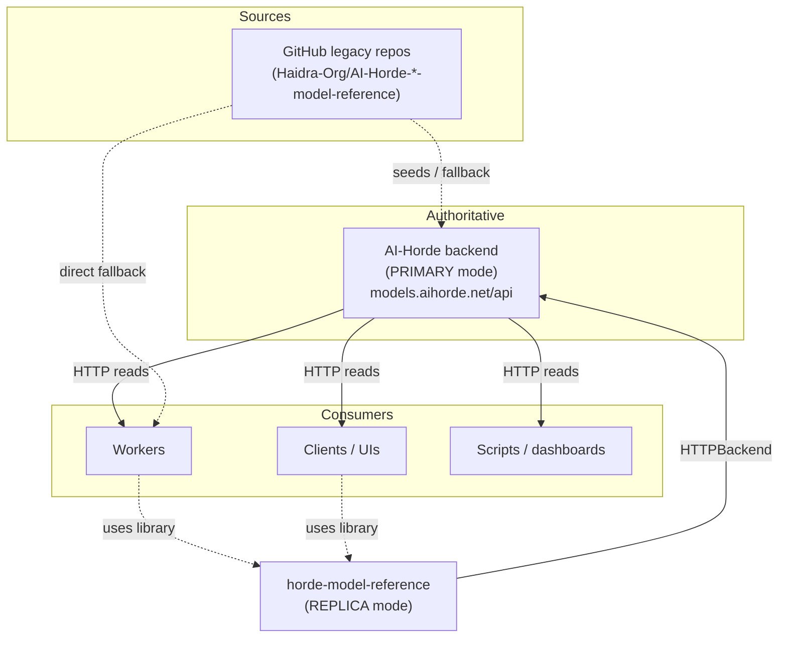

# The HTTP Service and Where It Fits

`horde-model-reference` is three things in one package: a set of JSON reference files, a Python
library, and a **FastAPI web service**. This page explains what the HTTP service is for, who
calls it, and how it relates to the library and the wider [AI-Horde](https://aihorde.net)
ecosystem. If you just want to start calling endpoints, jump to the
[Using the HTTP API](../tutorials/using_the_http_api.md) tutorial.

The public deployment lives at **`https://models.aihorde.net/api`** with interactive docs at
[`/api/docs`](https://models.aihorde.net/api/docs).

## What the service does

The service exposes the curated model-reference data - download URLs, checksums, baselines, NSFW
flags, capabilities - over HTTP, plus search, statistics, and a moderated workflow for proposing
changes. **Reads are open to everyone; writes are gated** (PRIMARY deployments only, authenticated,
and routed through a review queue - see below).

## Where it fits in the ecosystem

There are three consumer roles, and the same service serves all of them:

- **The AI-Horde backend** runs this service in **PRIMARY** mode as the canonical source of truth.
  It owns the data, accepts moderated writes, and serves everyone else. This is the deployment at
  `models.aihorde.net`.
- **Workers** (GPU nodes that fulfil generation requests) need to know which models exist, their
  download URLs, and their checksums. A worker typically consumes the data through the **Python
  library in REPLICA mode**, which fetches from the PRIMARY API and falls back to raw GitHub if the
  PRIMARY is unreachable. A worker can also call the HTTP API directly.
- **Clients, UIs, and tooling** (model browsers, admin dashboards, automation) call the HTTP API
  directly to list, search, and rank models, or to propose changes.

## The service and the Python library serve the same data

The FastAPI service and the `ModelReferenceManager` Python API are two front-ends over the same
backend. When you run the library in REPLICA mode with a `primary_api_url`, its `HTTPBackend`
calls the same endpoints documented here:

| Library call (REPLICA `HTTPBackend`) | HTTP endpoint it requests |
| ------------------------------------ | ------------------------- |
| fetch a category (v2)                | `GET {primary_api_url}/model_references/v2/{category}` |
| fetch a category (legacy fallback)   | `GET {primary_api_url}/model_references/v1/{category}` |

So "consume the API from a worker" and "use the library in REPLICA mode" are the same operation at
different layers. See [Consume the HTTP API](../guides/consume_the_http_api.md) for both styles, and
[Offline & Resilient Reads](../guides/offline_and_resilient_reads.md) for the fallback chain.

## Two API versions: v1 (legacy) and v2 (current)

| Version | Path prefix | Format | Use it for |
| ------- | ----------- | ------ | ---------- |
| **v2**  | `/api/model_references/v2` | Current normalized format, with search, per-model retrieval, statistics, and typed per-category schemas | New integrations |
| **v1**  | `/api/model_references/v1` | Legacy GitHub-compatible format | Existing AI-Horde workers that already read the legacy JSON shape |

Both versions are **readable** on any deployment. Which version accepts **writes** depends on the
deployment's `canonical_format` setting - see [Canonical Format](canonical_format.md). v1's outward
shape is frozen for backward compatibility; v2 is where new capabilities land.

## Reads are open, writes are reviewed

Read endpoints are unauthenticated and safe to cache. Write endpoints (create / update / delete a
model) are different in three ways:

1. **They require a PRIMARY deployment.** A REPLICA instance returns `503` for writes.
2. **They require an `apikey`** belonging to an allow-listed requestor.
3. **They are not applied immediately.** A successful write returns **`202 Accepted`** and enters a
   [pending queue](../reference/pending_queue.md): a separate approver reviews the change, then it is applied to
   the live dataset (propose -> approve -> apply). This two-person workflow protects the canonical
   data that the whole network depends on.

See [Submit Models via the API](../guides/submit_models_via_the_api.md) for the end-to-end write
walkthrough, and the [Request Lifecycle](request_lifecycle.md) for how a request flows through the
service internally.

## Discovering a deployment's capabilities

Two unauthenticated endpoints let a client adapt to whatever deployment it is talking to:

- **`GET /api/replicate_mode`** -> `{ "replicate_mode", "canonical_format", "writable" }`. Call this
  on startup to learn whether writes are accepted and which API version handles them.
- **`GET /api/heartbeat`** -> service status plus the health of the upstream AI-Horde API
  (used by statistics/popularity endpoints).

## Where to go next

- [Using the HTTP API](../tutorials/using_the_http_api.md) - hands-on first calls (curl + Python).
- [HTTP API Conventions](../reference/http_api/conventions.md) - base URL, auth, errors, pagination.
- [v2 Endpoints](../reference/http_api/v2_endpoints.md) - the full current-format reference.
- [Pending Queue](../reference/pending_queue.md) - the review workflow behind every write.
