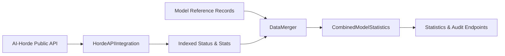

# Integrations

The integrations subsystem fetches live runtime data from the AI-Horde public API and merges it with static model reference records. This enables analytics endpoints to report on worker counts, usage statistics, and queue depth alongside model metadata.

## Data Flow



## HordeAPIIntegration

`HordeAPIIntegration` is a singleton that fetches and caches three types of runtime data from AI-Horde:

| Endpoint            | Data                                          | Indexed By |
| ------------------- | --------------------------------------------- | ---------- |
| `/v2/status/models` | Worker counts, queue depth, ETA, performance  | Model name |
| `/v2/stats/models`  | Usage counts (day, month, total)              | Model name |
| `/v2/workers`       | Worker details (online status, trust, uptime) | Worker ID  |

Each response type is modeled as Pydantic classes (`HordeModelStatus`, `HordeModelStatsResponse`, `HordeWorker`) and indexed into dictionaries keyed by model name for efficient lookup.

### Caching

The integration uses the same dual-layer caching pattern as the rest of the system:

- **Redis** (when available in PRIMARY mode) — shared cache with configurable TTL, key prefix `{redis_key_prefix}:horde_api`
- **In-memory** — per-type dictionaries with timestamp tracking for TTL enforcement

The `horde_api_cache_ttl` setting (default 60s) controls how long API responses are cached. A `force_refresh` parameter on fetch methods bypasses the cache for background hydration.

### Error Handling

API calls use `httpx` with a configurable timeout (`horde_api_timeout`, default 30s). Failures are logged and return empty results rather than propagating exceptions, so analytics endpoints degrade gracefully when the Horde API is unavailable.

## Data Merger

`DataMerger` provides pure functions that combine static model reference data with runtime API data. The primary entry point is `merge_category_with_horde_data()`:

```python
def merge_category_with_horde_data(
    model_names: list[str],
    horde_status: IndexedHordeModelStatus,
    horde_stats: IndexedHordeModelStats,
    workers: IndexedHordeWorkers | None,
    include_backend_variations: bool = False,
) -> dict[str, CombinedModelStatistics]:
```

For each model name, the function:

1. Looks up the model's status (worker count, queue depth, ETA, performance)
2. Extracts usage statistics (day/month/total counts)
3. Optionally resolves worker details into `WorkerSummary` objects
4. For text models with `include_backend_variations=True`, splits statistics by backend (aphrodite, koboldcpp)

The result is a `CombinedModelStatistics` per model, containing:

| Field                               | Source                                         |
| ----------------------------------- | ---------------------------------------------- |
| `worker_count`                      | Computed from worker summaries or status count |
| `queued_jobs`, `performance`, `eta` | Horde model status                             |
| `usage_stats` (day, month, total)   | Horde stats endpoint                           |
| `worker_summaries`                  | Horde workers endpoint (optional)              |
| `backend_variations`                | Per-backend breakdown for text models          |

## Backend Variations

Text generation models can be served by different backends (aphrodite, koboldcpp). When `include_backend_variations=True`, the merger produces per-backend `BackendVariation` entries showing which workers use which backend and their individual usage counts. This powers the audit analysis view that identifies models with uneven backend distribution.

## How Endpoints Use Merged Data

The statistics and audit analytics endpoints follow the same pattern:

1. Get model names and records from `ModelReferenceManager`
2. Fetch runtime data via `HordeAPIIntegration`
3. Merge with `merge_category_with_horde_data()`
4. Pass merged data to `CategoryStatistics` computation or `ModelAuditInfoFactory`
5. Cache the result in `StatisticsCache` or `AuditCache`

The [Analytics Pipeline](analytics_pipeline.md) page covers the computation and caching layers in detail.

!!! warning
The Horde API data reflects a point-in-time snapshot. Worker counts and usage stats can change rapidly. The caching TTL represents a trade-off between freshness and API load — production deployments should enable cache hydration to keep data warm without hammering the Horde API on every request.
