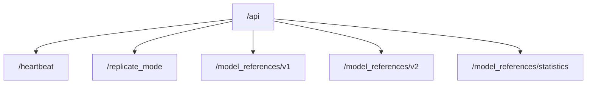
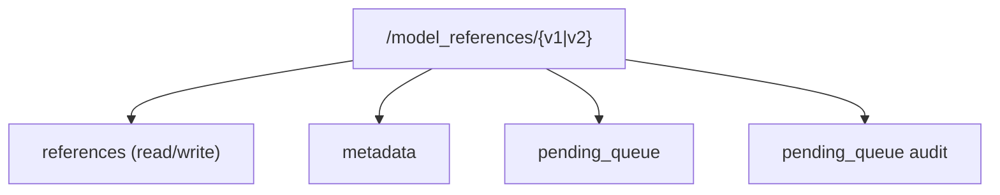
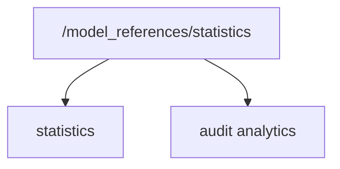
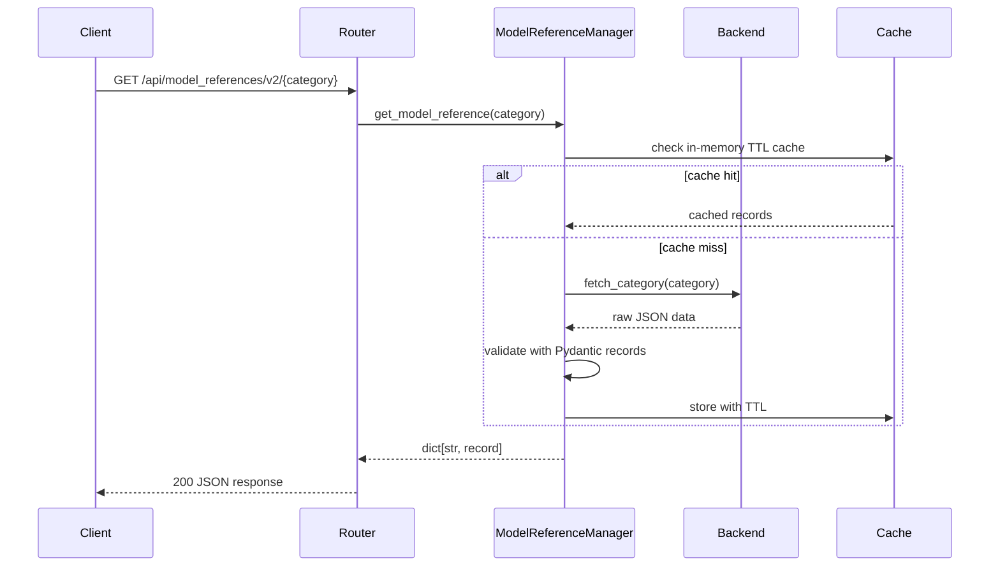
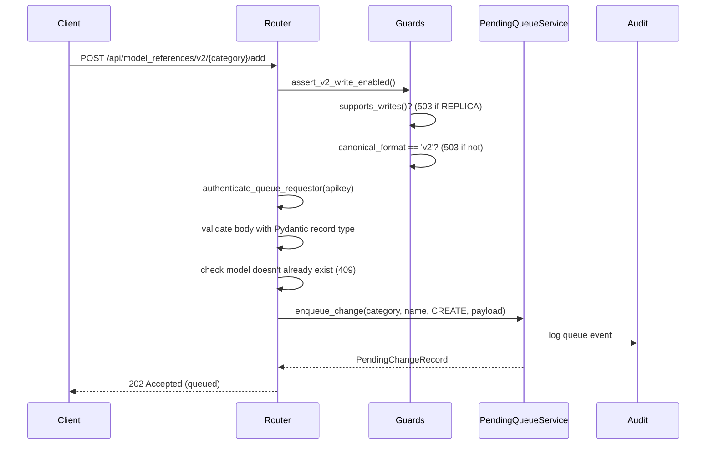

# Request Lifecycle

This page traces how the FastAPI service processes HTTP requests from client to response, covering both read and write flows.

## App Factory and Startup

The application is created in `service/app.py` with a `lifespan` handler that manages startup and shutdown:

- **Startup**: If `cache_hydration_enabled` is set, the `CacheHydrator` singleton begins background cache warming so analytics endpoints return fast responses from the first request.
- **Shutdown**: The hydrator is stopped gracefully, allowing in-flight hydration cycles to complete.

CORS middleware is configured from the `cors_allowed_origins` setting. An empty list produces a warning at startup since it falls back to FastAPI's default (deny all cross-origin).

## Router Mount Structure

All routers are mounted under the `/api` root path:

Each model reference namespace exposes the following sub-routes:

The `/replicate_mode` endpoint returns a `BackendInfo` response containing the current `replicate_mode`, `canonical_format`, and `writable` flag. Clients should call this on startup to determine which API version to use for write operations.

## Dependency Injection

`service/shared.py` provides the key dependencies:

- **`get_model_reference_manager()`** - returns the `ModelReferenceManager` singleton
- **`assert_canonical_write_enabled()`** - guards write endpoints with two checks: mode (PRIMARY required) and canonical format (must match the API version)
- **`authenticate_queue_requestor()` / `authenticate_queue_approver()`** - validates API keys against the AI-Horde `/v2/find_user` endpoint and checks the user ID against configured allowlists

## Read Request Flow

A typical read request follows this path:

The manager's in-memory cache uses a configurable TTL (default 60 seconds). On cache miss, the backend fetches data - from the filesystem (PRIMARY), PRIMARY API or GitHub (REPLICA) - and the manager validates it through the appropriate Pydantic record type from `MODEL_RECORD_TYPE_LOOKUP`.

## Write Request Flow

Write operations go through the pending queue rather than modifying data directly:

Write endpoints return **202 Accepted** because changes are queued for approval rather than
applied immediately. The pending queue workflow (propose, approve, apply) is documented in
the [Pending Queue](../reference/pending_queue.md) reference.

## Write Guard Checks

Every write endpoint performs two sequential checks via `assert_canonical_write_enabled()`:

1. **Mode check** - `backend.supports_writes()` must return `True` (only PRIMARY backends do). Returns 503 if the instance is in REPLICA mode.
2. **Format check** - the configured `canonical_format` must match the API version being called. v2 endpoints require `canonical_format='v2'`; v1 endpoints require `canonical_format='legacy'`. Returns 503 on mismatch.

This dual-gate ensures that write traffic is routed to exactly one API version at any given time, preventing split-brain data issues.

## Authentication

Write and pending-queue endpoints authenticate via the `apikey` header:

1. The API key is sent to AI-Horde's `/v2/find_user` endpoint.
2. The response yields a username in `Name#ID` format; the numeric ID is extracted.
3. The ID is checked against configured allowlists (`requestor_ids` for submissions, `approver_ids` for approvals).
4. If no allowlists are configured, a hardcoded fallback list is used with a warning logged.

## Error Handling Patterns

| Status | Meaning                                                         |
| ------ | --------------------------------------------------------------- |
| 400    | Invalid request format or name mismatch                         |
| 401    | Invalid or unauthorized API key                                 |
| 404    | Category or model not found                                     |
| 409    | Model already exists (POST create only)                         |
| 422    | Pydantic validation errors                                      |
| 500    | Unexpected errors (file I/O, backend failures)                  |
| 503    | Wrong mode (REPLICA attempting write) or wrong canonical format |

The 503 responses include descriptive messages explaining which configuration change is needed, making misconfiguration easy to diagnose.

## Cache Invalidation

When a queued change is approved and applied, the apply step invalidates caches at all layers:

- Manager in-memory cache for the affected category
- Backend cache (file mtime tracking for filesystem, Redis keys for RedisBackend)
- Analytics caches (statistics, audit) for the affected category

This ensures subsequent read requests pick up the updated data without waiting for TTL expiry.
