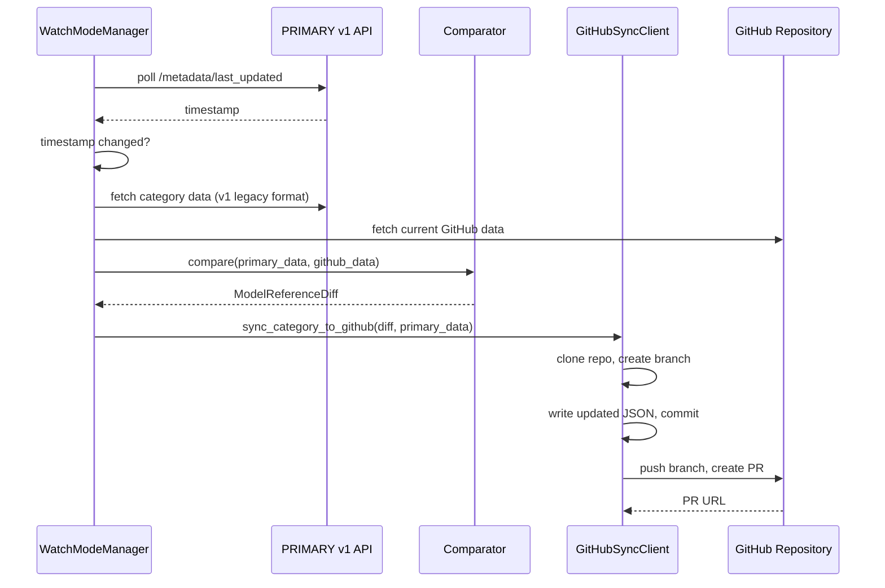

# Sync System

The sync system keeps legacy GitHub repositories in sync with the PRIMARY instance. While PRIMARY is the authoritative source of model reference data, the original GitHub repos (`Haidra-Org/AI-Horde-image-model-reference`, `Haidra-Org/AI-Horde-text-model-reference`) must stay updated for backward compatibility with existing AI-Horde workers and clients that read directly from GitHub.

## How It Works

The sync pipeline has four stages: **detect** changes via metadata polling, **compare** PRIMARY vs GitHub state, **transform** data for the legacy format, and **publish** via pull request.

## Configuration

`HordeGitHubSyncSettings` controls sync behavior with the `HORDE_GITHUB_SYNC_` environment variable prefix:

| Setting | Purpose |
|---------|---------|
| `primary_api_url` | PRIMARY instance v1 API base URL (required) |
| `github_token` | Personal access token with repo write permissions |
| `categories_to_sync` | Whitelist of categories (defaults to all) |
| `min_changes_threshold` | Minimum changes needed to create a PR (default: 1) |
| `dry_run` | Compare without creating PRs |
| `watch_mode` | Enable continuous monitoring |
| `watch_interval_seconds` | Polling interval (default: 60s) |
| `target_clone_dir` | Persistent clone directory for reuse across runs |

## Authentication

Two authentication methods are supported, with GitHub App taking precedence:

**GitHub App** (preferred for production): Configure `GITHUB_APP_ID`, `GITHUB_APP_INSTALLATION_ID`, and either `GITHUB_APP_PRIVATE_KEY` (inline PEM) or `GITHUB_APP_PRIVATE_KEY_PATH` (file path). Installation tokens are automatically refreshed.

**Personal Access Token**: Set `HORDE_GITHUB_SYNC_GITHUB_TOKEN` or the standard `GITHUB_TOKEN` environment variable. Simpler but less secure for long-running deployments.

## Comparator

`ModelReferenceComparator` performs a set-difference comparison between PRIMARY and GitHub data for each category:

- **Added models** — present in PRIMARY but not in GitHub
- **Removed models** — present in GitHub but not in PRIMARY
- **Modified models** — present in both but with different content

The result is a `ModelReferenceDiff` dataclass that drives branch naming, commit messages, and PR descriptions.

## GitHubSyncClient

The sync client handles the git workflow for publishing changes:

1. **Clone or reuse** — clones the target repo to a temp directory, or reuses a persistent clone (verified by remote URL and branch). Persistent clones are reset to `origin/{branch}` before each run.
2. **Branch** — creates `sync/{category}/{timestamp}` (or `sync/multi-category/{timestamp}` for batched syncs). A context manager ensures the original branch is restored on exit.
3. **Transform** — writes the PRIMARY data as JSON. For `text_generation`, applies `LegacyTextValidator` and generates backend-prefix duplicates (`aphrodite/`, `koboldcpp/`) to match the legacy GitHub format.
4. **Commit and push** — commits with a structured message listing added/removed/modified models, then pushes using the authenticated URL.
5. **PR creation** — creates a pull request via the GitHub API, closes any existing sync PRs for the same category, and applies configured labels and reviewers.

!!! tip
    Use `target_clone_dir` in production to avoid re-cloning on every sync cycle. The client verifies repository identity (owner/repo from the remote URL) before reusing an existing clone, preventing data corruption from mismatched directories.

## Watch Mode

`WatchModeManager` provides continuous sync by polling the PRIMARY metadata endpoint:

1. Fetches the `last_updated` timestamp from `/model_references/v1/metadata/last_updated`
2. Compares against the previously known timestamp
3. Triggers the sync callback when a change is detected
4. Tracks consecutive errors and stops after 10 failures with a critical log message

The first poll initializes the baseline timestamp. A startup sync can be triggered immediately via `watch_enable_startup_sync`. Periodic status messages are logged every 5 minutes to confirm the watcher is alive.

## Multi-Category Sync

When multiple categories map to the same GitHub repository, the client can batch them into a single PR via `sync_multiple_categories_to_github()`. This reduces PR noise and ensures related changes are reviewed together.

## Text Generation Special Handling

The `text_generation` category requires extra transformation during sync:

- **Filename**: GitHub uses `db.json` rather than `text_generation.json`
- **Validation**: `LegacyTextValidator` checks field requirements for the legacy format
- **Backend prefixes**: Each base model is tripled into `{name}`, `aphrodite/{name}`, and `koboldcpp/{model_name}` entries to maintain backward compatibility with workers that look up models by backend-prefixed name
