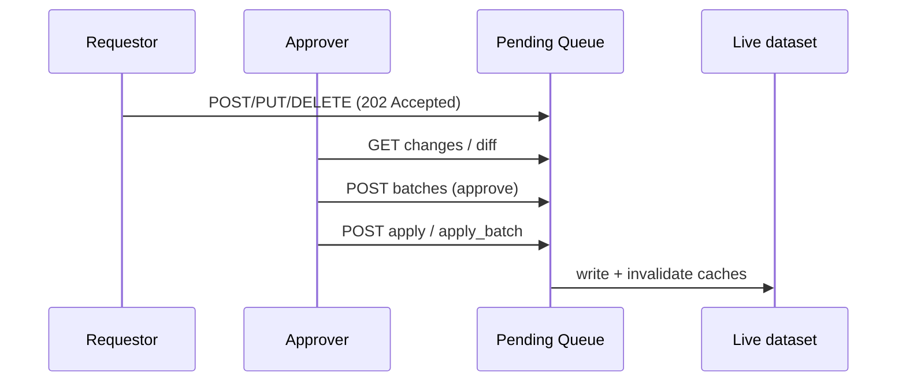

# Submit Models via the API

**Goal:** propose a model change (create / update / delete) and follow it through the review queue
to the live dataset. Writes are deliberately a multi-step, two-person workflow - this guide shows
each step end-to-end.

Background: [The HTTP Service -> Reads are open, writes are reviewed](../concepts/http_service.md#reads-are-open-writes-are-reviewed)
and the [Pending Queue](../reference/pending_queue.md) concept page.

## Prerequisites

1. **A PRIMARY deployment in `v2` canonical format.** Confirm with:

    ```bash
    curl https://models.aihorde.net/api/replicate_mode
    # need: "writable": true and "canonical_format": "v2"
    ```

2. **An AI-Horde API key on the allowlist.** Check your roles:

    ```bash
    curl -H "apikey: $AI_HORDE_API_KEY" \
      https://models.aihorde.net/api/model_references/v2/me/roles
    # {"user_id":"123","username":"you#123","roles":["requestor"],"is_requestor":true,"is_approver":false}
    ```

    You need `is_requestor: true` to propose, and an `is_approver: true` user (possibly someone else)
    to approve and apply.

All write requests carry the key in the `apikey` header.

!!! note "Two-person review is a practice, not a hard gate"
    The propose -> approve -> apply split is *designed* for two people, but it is **not enforced in
    code**: a single key that holds the approver role can propose, approve, and apply its own change.
    To actually require a second pair of eyes, keep requestor-only and approver keys with different
    people - separation is an operational policy, not a server-side block.

## Step 1 - Propose a change (requestor)

Create a new model with the **typed per-category** endpoint. The body is the category's concrete
record; the model name comes from the body's `name` field:

```bash
curl -X POST "https://models.aihorde.net/api/model_references/v2/image_generation" \
  -H "apikey: $AI_HORDE_API_KEY" \
  -H "Content-Type: application/json" \
  -d '{
    "name": "my_finetune_xl",
    "baseline": "stable_diffusion_xl",
    "nsfw": false,
    "description": "Example fine-tune",
    "config": {"download": [{"file_name": "my.safetensors", "sha256sum": "abc...", "file_url": "https://..."}]}
  }'
```

A successful proposal returns **`202 Accepted`** and a `PendingChangeRecord` - it is *not* live yet:

```json
{ "change_id": 42, "operation": "create", "model_name": "my_finetune_xl", "status": "pending", ... }
```

- **Update** an existing model: `PUT /model_references/v2/{category}/{model_name}` (the path
  `model_name` must match the body `name`).
- **Delete** a model: `DELETE /model_references/v2/{category}/{model_name}`.
- Any category works; the typed routes exist for `image_generation`, `text_generation`,
  `controlnet`, and every other category. There is also a generic `POST /{category}/add` if you
  prefer a single uniform endpoint.

!!! warning "text_generation: submit base names only"
    For `text_generation`, submit the **base** model name. Backend-prefixed variants
    (`aphrodite/…`, `koboldcpp/…`) are generated automatically; submitting one returns `400`.

Common rejections: `409` (model already exists - use `PUT`), `422` (body failed validation, or wrong
schema for the category), `503` (REPLICA, or wrong canonical format).

### Track your proposal (requestor)

Your change sits in the queue until an approver acts on it. You don't need approver access to follow
it: `my_changes` returns only the changes *you* submitted, with each one's current `status`
(`pending`, `approved`, `applied`, or `rejected`):

```bash
curl -H "apikey: $AI_HORDE_API_KEY" \
  "https://models.aihorde.net/api/model_references/v2/pending_queue/my_changes?limit=50"
```

## Step 2 - Review the queue (approver)

An approver lists what is pending:

```bash
curl -H "apikey: $APPROVER_KEY" \
  "https://models.aihorde.net/api/model_references/v2/pending_queue/changes?statuses=pending&limit=50"
```

Inspect a single change and its diff against current state:

```bash
curl -H "apikey: $APPROVER_KEY" \
  https://models.aihorde.net/api/model_references/v2/pending_queue/changes/42
curl -H "apikey: $APPROVER_KEY" \
  https://models.aihorde.net/api/model_references/v2/pending_queue/changes/42/diff
```

## Step 3 - Approve (or reject) a batch (approver)

Approve one or more changes as a titled batch (or reject with a reason):

```bash
curl -X POST "https://models.aihorde.net/api/model_references/v2/pending_queue/batches" \
  -H "apikey: $APPROVER_KEY" -H "Content-Type: application/json" \
  -d '{"batch_title":"June models","approved_ids":[42],"rejected_ids":[]}'
```

Approved changes share a `batch_id`. See [Pending Queue](../reference/pending_queue.md) for
batch-ID semantics and partial-apply behaviour.

## Step 4 - Apply approved changes (approver)

Applying writes the change to the live dataset and invalidates caches:

```bash
# Apply a single approved change...
curl -X POST "https://models.aihorde.net/api/model_references/v2/pending_queue/changes/42/apply" \
  -H "apikey: $APPROVER_KEY" -H "Content-Type: application/json" -d '{}'

# ...or apply an entire approved batch
curl -X POST "https://models.aihorde.net/api/model_references/v2/pending_queue/apply_batch/7" \
  -H "apikey: $APPROVER_KEY"
```

After apply, the model is live:

```bash
curl https://models.aihorde.net/api/model_references/v2/image_generation/my_finetune_xl
```

## The flow at a glance



## Full endpoint details

- [Pending Queue endpoints](../reference/http_api/pending_queue_endpoints.md) - list, diff, purge,
  batches, apply variants, and the audit views.
- [v2 write endpoints](../reference/http_api/v2_endpoints.md#write-operations) - create/update/delete
  request and response shapes.
- [text_generation utilities](../reference/http_api/v2_text_utils.md) - groups, aliases, families,
  and naming schemas (also routed through the queue where they mutate models).
