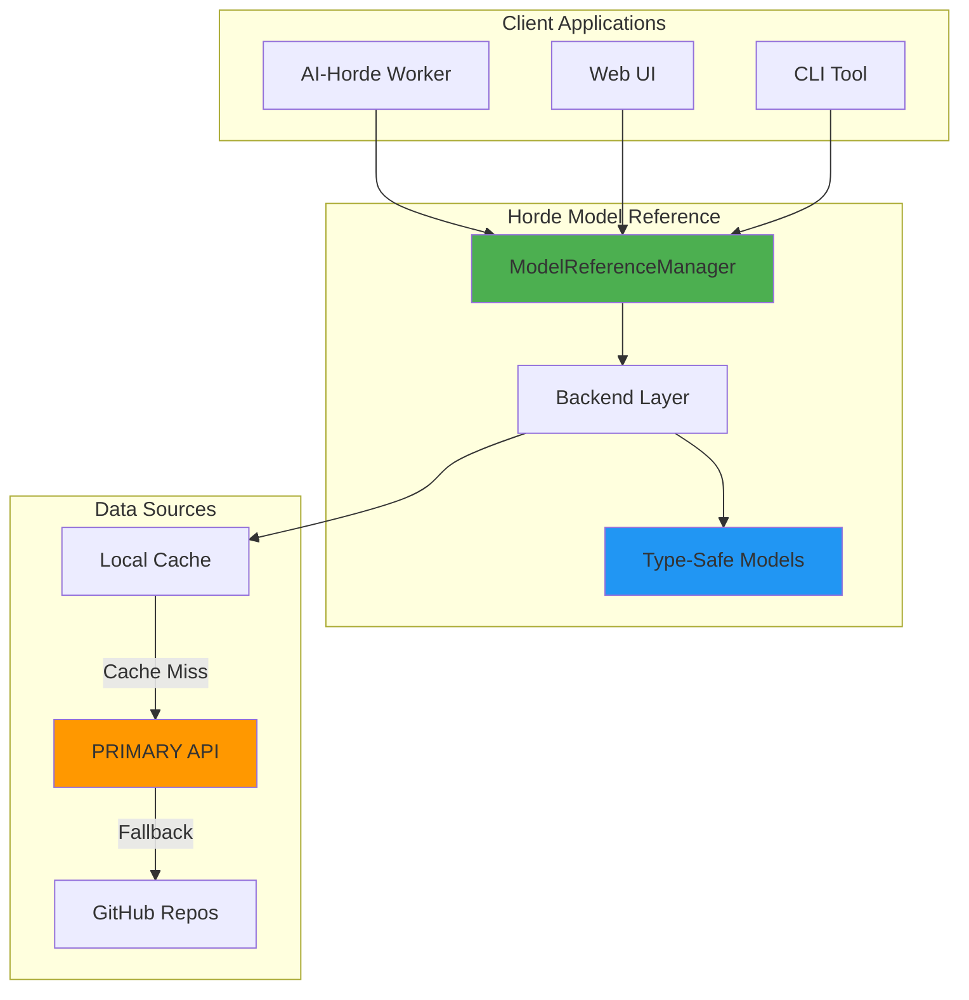

# Horde Model Reference

<p align="center">
  
</p>

<p align="center">
  <a href="https://github.com/Haidra-Org/horde-model-reference/actions"></a>
  <a href="https://pypi.org/project/horde-model-reference/"></a>
  <a href="https://pypi.org/project/horde-model-reference/"></a>
  <a href="https://github.com/Haidra-Org/horde-model-reference/blob/main/LICENSE"></a>
</p>

**Horde Model Reference** is the authoritative source for AI model metadata in the [AI-Horde](https://aihorde.net) ecosystem. It provides validated, type-safe access to information about thousands of AI models including image generation models (Stable Diffusion, FLUX, etc.), text generation models (LLMs), and utility models (CLIP, ControlNet, upscalers, etc.).

---

## What is Horde Model Reference?

**Horde Model Reference** serves three purposes:

1. **📄 JSON Reference Files**: Canonical model metadata (names, checksums, download URLs, capabilities)
2. **🐍 Python Library**: Type-safe, programmatic access with automatic updates and validation
3. **🌐 FastAPI Service**: REST API for distributing model references across the horde

### The Problem It Solves

When building applications that use AI models, you need:

- **Verified model metadata** (checksums, download URLs, capabilities)
- **Up-to-date information** as models are added, updated, or deprecated
- **Type safety** to catch errors at development time
- **Easy integration** regardless of your tech stack

Horde Model Reference provides all of this through a simple, consistent interface.

---

## Quick Start

### Installation

```bash
pip install horde-model-reference
```

### Basic Usage

```python
from horde_model_reference import ModelReferenceManager, MODEL_REFERENCE_CATEGORY

# Create manager - automatically fetches latest model data
manager = ModelReferenceManager()

# Get all image generation models
image_models = manager.get_model_reference(MODEL_REFERENCE_CATEGORY.image_generation)

print(f"Found {len(image_models)} image generation models")

# Access a specific model
if "stable_diffusion_xl" in image_models:
    sdxl = image_models["stable_diffusion_xl"]
    print(f"Model: {sdxl.name}")
    print(f"Baseline: {sdxl.baseline}")
    print(f"NSFW: {sdxl.nsfw}")
```

**That's it!** The library handles downloading, caching, and validation automatically.

---

## Key Features

### ✅ Validated Metadata
Every model includes verified SHA256 checksums, download URLs, baselines, NSFW flags, and capability information.

### 🗃️ Multiple Categories
Support for image generation, text generation, CLIP, ControlNet, ESRGAN, GFPGAN, safety checkers, and more.

### 🔒 Type-Safe
Full type annotations with strict mypy checking and Pydantic models for runtime validation.

### 🌐 REST API
FastAPI service with automatic OpenAPI documentation for non-Python integrations.

### 📦 Legacy Compatible
Automatic conversion from legacy GitHub format to new standardized format.

### 🐳 Docker Ready
Pre-built Docker images and docker-compose configurations for production deployments.

---

## Use Cases

### For AI-Horde Workers
Workers need to know which models are approved, where to download them, and what capabilities they support.

```python
from horde_model_reference import ModelReferenceManager, MODEL_REFERENCE_CATEGORY

manager = ModelReferenceManager()

# Get approved image models
available_models = manager.get_model_reference(
    MODEL_REFERENCE_CATEGORY.image_generation
)

# Filter by GPU capabilities
supported_models = {
    name: model
    for name, model in available_models.items()
    if model.baseline == "stable_diffusion_xl"
}

print(f"Worker can serve {len(supported_models)} SDXL models")
```

### For Client Applications
Applications need to present users with available models and their capabilities.

```python
from horde_model_reference import ModelReferenceManager, MODEL_REFERENCE_CATEGORY

manager = ModelReferenceManager()

# Get all text generation models
text_models = manager.get_model_reference(MODEL_REFERENCE_CATEGORY.text_generation)

# Display to users
for name, model in text_models.items():
    print(f"{name}")
    print(f"  Parameters: {model.parameters_count}")
    print(f"  Description: {model.description}")
```

### For Model Management Tools
Tools need to validate models, check for updates, and manage downloads.

```python
from horde_model_reference import ModelReferenceManager, MODEL_REFERENCE_CATEGORY

manager = ModelReferenceManager()

# Get model with download information
model = manager.get_model(
    MODEL_REFERENCE_CATEGORY.image_generation,
    "stable_diffusion_xl"
)

# Access download URLs and checksums
for download in model.config.download:
    print(f"File: {download.file_name}")
    print(f"URL: {download.file_url}")
    print(f"SHA256: {download.sha256sum}")
```

---

## Architecture Overview



### Component Roles

- **ModelReferenceManager**: Main entry point for accessing model references
- **Backend Layer**: Pluggable architecture supporting multiple data sources (PRIMARY API, GitHub, filesystem, Redis)
- **Type-Safe Models**: Pydantic models providing validation and type safety
- **Data Sources**: PRIMARY server (production), GitHub (fallback), local cache (performance)

---

## Documentation Structure

### Getting Started
- **[Onboarding Guide](onboarding.md)** - Step-by-step tutorials with realistic scenarios
- **Installation & Setup** - Detailed installation instructions for different use cases

### Core Concepts
- **Model Categories** - Understanding the different types of models
- **Type Safety** - Leveraging Pydantic models for robust applications
- **Caching & Performance** - How the library optimizes data fetching

### Deployment
- **[Deployment Guide](../DEPLOYMENT.md)** - Running your own PRIMARY server
- **[GitHub Sync](../DOCKER_SYNC.md)** - Optional automated sync to legacy repos
- **Production Best Practices** - Multi-worker deployments with Redis

### API Reference
- **[API Documentation](horde_model_reference/)** - Auto-generated API docs
- **[Model Records](horde_model_reference/model_reference_records.md)** - Model data structures
- **[Backend Architecture](model_reference_backend.md)** - Backend system design

---

## Community & Support

- **💬 Discord**: [AI Horde Discord](https://discord.gg/3DxrhksKzn) - `#horde-model-reference` channel
- **🐛 Bug Reports**: [GitHub Issues](https://github.com/Haidra-Org/horde-model-reference/issues)
- **💡 Feature Requests**: [GitHub Discussions](https://github.com/Haidra-Org/horde-model-reference/discussions)
- **📖 AI-Horde Glossary**: [Horde Concepts](haidra-assets/docs/definitions.md)

---

## What's Next?

Ready to dive in? Check out the **[Onboarding Guide](onboarding.md)** for realistic examples and best practices.

Looking to deploy your own server? See the **[Deployment Guide](../DEPLOYMENT.md)**.

Need API details? Explore the **[API Reference](horde_model_reference/)**.

---

## License

This project is licensed under the **GNU Affero General Public License v3.0** (AGPL-3.0).

- ✅ **Free to use** for any purpose (personal, commercial, research)
- ✅ **Free to modify** and distribute modifications
- ⚠️ **Must disclose source** if you run a modified version as a network service
- ⚠️ **Must use same license** for derivative works

See [LICENSE](https://github.com/Haidra-Org/horde-model-reference/blob/main/LICENSE) for details.
