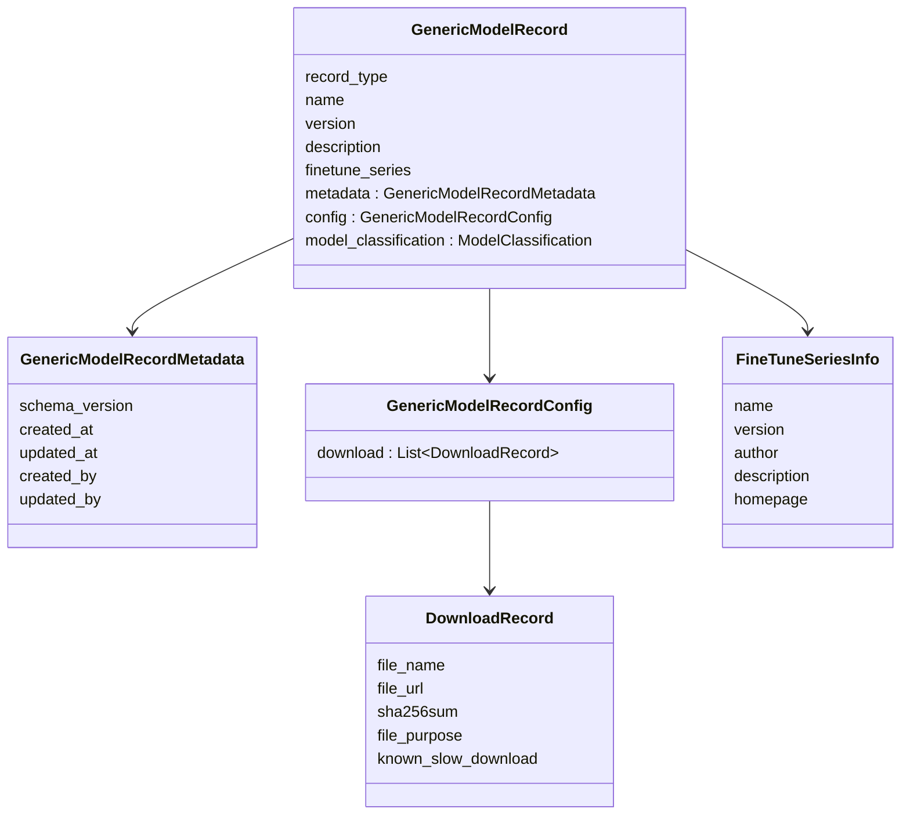

# Model Reference Records

## Design Overview

- `GenericModelRecord` is the canonical, schema-versioned data carrier for every model entry consumed by the service layer and persisted by [`ModelReferenceBackend`][horde_model_reference.backends.base.ModelReferenceBackend].
- It encapsulates shared fields (identity, metadata, download config, classification) and delegates category-specific concerns to subclasses registered via `register_record_type()`.
- The class is deliberately Pydantic-based so conversion to and from on-disk JSON requires no bespoke serializers and enforces schema contracts at load time.
- Validation is policy-driven: unknown baselines or styles are checked against the `KindPolicy` registry so categories can independently choose whether unexpected values are errors or soft warnings.

## Composition

| Component           | Purpose                                                                                                                         | Key types                                                                                                       |
| ------------------- | ------------------------------------------------------------------------------------------------------------------------------- | --------------------------------------------------------------------------------------------------------------- |
| Identity            | `record_type` discriminator plus `name`/`version`/`description` fields establish the record’s unique identity and display text. | `MODEL_REFERENCE_CATEGORY`, `ModelClassification`                                                               |
| Metadata            | Tracks schema version and audit-style provenance (`created_at`, `updated_at`, `created_by`, `updated_by`).                      | `GenericModelRecordMetadata`                                                                                    |
| Download config     | Normalized download entries, typically checkpoint files, with checksum and slow-download hints.                                 | `GenericModelRecordConfig`, `DownloadRecord`                                                                    |
| Fine-tuning lineage | Optional `finetune_series` captures source series provenance.                                                                   | `FineTuneSeriesInfo`                                                                                            |
| Classification      | Defaulted from the category descriptor to keep domain/purpose consistent with category definitions.                             | [`get_category_descriptor`][horde_model_reference.meta_consts.get_category_descriptor] -> `ModelClassification` |

> **Environment-aware config:** `get_default_config()` tightens `model_config.extra` to `forbid` in CI (`ai_horde_testing=True`) and `ignore` elsewhere, giving strict validation in tests without blocking backward-compatible ingest in production.

## Registration and Specialization

- `register_record_type(category)` maintains a global `MODEL_RECORD_TYPE_LOOKUP` so callers (e.g., [`ModelReferenceManager`][horde_model_reference.model_reference_manager.ModelReferenceManager]) can resolve the correct subclass per category.
- Unregistered categories fall back to `GenericModelRecord`, but every enum value is pre-populated during module import to avoid accidental gaps.
- Specialized subclasses add fields and validators appropriate to their domain:
    - `ImageGenerationModelRecord` validates baselines/styles against `KnownImageGenerationBaseline` and `MODEL_STYLE` using the `KindPolicy` registry.
    - `ControlNetModelRecord` checks `controlnet_style` against `CONTROLNET_STYLE` but only warns by default.
    - `TextGenerationModelRecord` aliases `parameters` to `parameters_count` for compatibility with upstream schemas.

## Validation Flow

- Field-level policies come from [`kind_policy_registry`][horde_model_reference.model_kind_validation.kind_policy_registry] and [`FieldPolicy`][horde_model_reference.model_kind_validation.FieldPolicy]; categories can upgrade an unknown value from debug to hard error without touching record code.
- `ImageGenerationModelRecord` uses `_apply_policy()` to enforce known `baseline` and `style` values via [`is_known_image_baseline`][horde_model_reference.meta_consts.is_known_image_baseline] and [`is_known_model_style`][horde_model_reference.meta_consts.is_known_model_style].
- `ControlNetModelRecord` validates `controlnet_style` via [`is_known_controlnet_style`][horde_model_reference.meta_consts.is_known_controlnet_style], defaulting to warnings so new control types can appear without breaking ingestion pipelines.
- Validators normalize optional list fields (`tags`, `showcases`, `trigger`) to empty lists to simplify downstream consumers and serialization.

## Extending for a New Category

1. Define a new subclass extending `GenericModelRecord` with category-specific fields and validators.
2. Decorate it with `@register_record_type(MODEL_REFERENCE_CATEGORY.<category>)` so lookups succeed through `get_record_type_for_category()`.
3. If the category introduces new enumerations, register a `KindPolicy` in [`kind_policy_registry`][horde_model_reference.model_kind_validation.kind_policy_registry] to control error/warning behavior for unknown values.
4. Optionally document the category’s additional semantics alongside the base schema for clarity in downstream clients.
